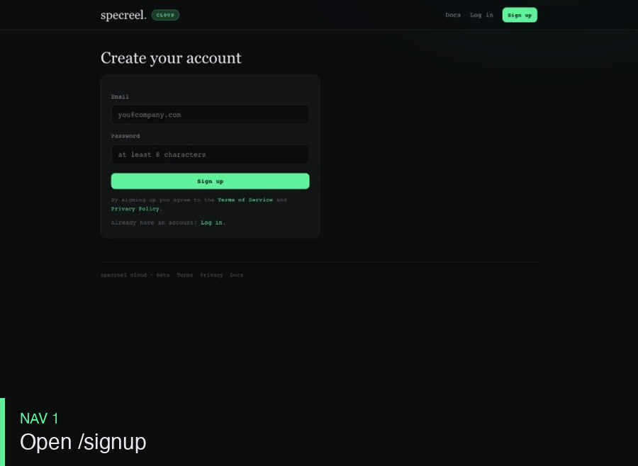

# specreel

[](https://github.com/specreel/specreel/actions/workflows/tests.yml)
[](https://pypi.org/project/specreel/)
[](https://pypi.org/project/specreel/)
[](LICENSE)

**Turn the Playwright `trace.zip` your tests already produce into a watchable,
shareable demo — and regenerate it on every green build, so the demo can't go
stale.** When it would, a test fails instead.

> A demo and an end-to-end test are the same artifact: a recorded browser flow.
> Record/prompt once → replay = demo, share = send, assert = test.



<sub>↑ produced by `specreel trace.zip -o out/ --gif` — nothing scripted, that's a real test run.</sub>

Captions are deterministic by default (no AI, no network). AI narration is
opt-in + BYO-key. Runtime is stdlib-only (Pillow only for `--mp4`); it's one file.

- [Install](#install) · [Quickstart](#quickstart) · [Getting a trace](#getting-a-trace)
- [The gallery & players](#the-gallery--players) · [AI narration](#ai-narration)
- [Configuration](#configuration) · [Publishing](#publishing--sharing)
- [GitHub Action](#github-action-the-freshness-loop) · [CLI](#cli-reference) · [Docs](#docs--more)

---

## Install
```bash
pip install specreel            # the CLI (core is stdlib-only)
pip install "specreel[mp4]"     # + Pillow, for --mp4 export
pip install "specreel[mcp]"     # + an MCP server, to drive it from an AI coding tool
```
Prefer not to learn the CLI? An MCP server and a Claude Code skill let you drive
Specreel from Claude Code / Cursor / Claude Desktop — see [integrations/](integrations/README.md).

Running from a checkout instead of an install? Use `python -m specreel …` in place
of `specreel …` in any command below.

## Quickstart

**No tests yet?** Point it at your running app — it crawls, suggests flows, and
scaffolds a runnable Playwright script:
```bash
specreel recommend http://localhost:3000   # -> specreel_flows.py
python specreel_flows.py                             # -> test-results/*/trace.zip
specreel test-results -o site --bundle     # -> the gallery
```

**Have a trace?** One trace → one demo:
```bash
specreel path/to/trace.zip -o out/ --title "Sign up flow" --mp4
# -> out/demo.html (self-contained, shareable)   out/demo.mp4 (optional)
```

**Have a whole test run?** A directory → a gallery:
```bash
specreel test-results/ -o site/ --bundle
# -> site/index.html        gallery, one card per flow
# -> site/<flow>/demo.html  a player per flow
# -> site/gallery.html      ONE portable file (gallery + every player inlined)
# -> site/manifest.json     machine-readable index
```

## Getting a trace
Turn tracing on so Playwright records screenshots (that's what makes it watchable):

**JS/TS** — `playwright.config.ts`: `use: { trace: 'on' }`
**Python** — `pytest --tracing on`, or:
```python
context.tracing.start(screenshots=True, snapshots=True)
# ... your test ...
context.tracing.stop(path="trace.zip")
```
Works on traces from Playwright JS/TS, Python, Java, or .NET — the parser is
language-agnostic.

## The gallery & players
- **Cards** carry a **demo** + **test** pill from the one source, a real end-state
  thumbnail, playback duration, and a freshness badge.
- **Players** have Prev/Play/Next, keyboard arrows, a step list, a **🔊 read-aloud**
  toggle (Web Speech, no audio files), and — in the bundle — a **▶ Play all** tour.
- **Freshness:** each build diffs every flow's step signature against the previous
  `manifest.json`; a flow that changed but still passes gets an amber `⟳ updated`
  badge (the UI moved, the test stayed green, the demo refreshed).
- **`gallery.html`** is a single self-contained file — email it, or host it anywhere.
- **Themes:** `--theme dark|light` (or `theme:` in config).

## AI narration
Optional layer that rewrites the deterministic captions into friendlier,
sales-engineer-style lines. **Opt-in, BYO-key, ~<$0.01/flow.**
```bash
export ANTHROPIC_API_KEY=sk-ant-...
specreel test-results/ -o site/ --ai
```
The literal caption stays the source of truth (shown as a sub-line); no key or any
error degrades gracefully to literal captions; password/secret fields are masked.
More in [docs/ai-narration.md](docs/ai-narration.md).

## Configuration
A `specreel.yml` (auto-discovered, or `--config`) configures a gallery build —
parsed by a tiny built-in YAML subset (no PyYAML). Generate one with
`specreel init <traces>`.
```yaml
title: My App — Product Flows
product_name: My App        # AI narration says this, not localhost URLs
theme: dark                 # dark | light
ai: false                   # true (+ key) to narrate
bundle: false               # true to also emit gallery.html
setup_urls: [/login]        # leading nav steps to drop from every demo
flows:
  signup: { title: Sign up, public: true }
  internal-admin: { hidden: true }
```
Full key reference: [docs/configuration.md](docs/configuration.md).

## Publishing & sharing
```bash
specreel publish site/ --to ghpages       # gh-pages -> Pages URL + <iframe> embed
specreel publish site/ --to dir:/var/www  # or copy into any static webroot
```
`ghpages` needs a GitHub remote; it builds a clean single-commit `gh-pages` branch,
force-pushes, and prints the URL + embed snippet. Or just send `site/gallery.html`.
Post build summaries to Slack with `--notify <webhook>`.

**Hosted option — Specreel Cloud** (`cloud/`): a self-hostable Flask service for
hosted galleries with a dashboard, public/private visibility, and view analytics.
```bash
specreel publish site/ --to cloud --project my-app \
  --cloud-url https://cloud.example --token scl_xxx
```
The hosted service is a separate proprietary codebase (open-core) — sign up at
[app.specreel.dev](https://app.specreel.dev), or self-serve docs at [specreel.dev](https://specreel.dev).

## GitHub Action (the freshness loop)
`examples/github-workflows/specreel.yml` publishes the gallery to GitHub Pages on every
push to `main`, and posts a **sticky PR comment** with a per-flow summary on pull
requests — so the demo can't be older than the last passing build. See
[docs/github-action.md](docs/github-action.md).

## CLI reference
| Command | Does |
|---|---|
| `specreel <trace\|dir> -o out` | Render a demo (single) or gallery (directory). |
| `specreel recommend <url>` | Crawl a running app → suggest + scaffold flows. |
| `specreel init <traces>` | Scaffold a `specreel.yml`. |
| `specreel publish <site> --to ghpages\|dir:<p>` | Deploy a gallery to a URL. |
| `specreel summary <site>` | Markdown build summary (for PR comments / CI). |

Key flags: `--bundle --ai [--ai-model M] --theme dark|light --mp4 --notify <url> --config f --strict --quality --gif`.
Full reference: [docs/cli-reference.md](docs/cli-reference.md).

## Docs & more
- 📚 **[docs/](docs/index.md)** — quickstart, CLI, config, recommend, publishing, AI, the Action.
- 🧪 Dev: `python -m pytest`. Single file: `specreel.py`.

## License

The Specreel CLI is **[AGPL-3.0-or-later](LICENSE)** — free to use, modify, and
self-host; changes to network-served derivatives must be shared. The hosted service
(`cloud/`) is proprietary. Contributions: see [CONTRIBUTING.md](CONTRIBUTING.md).
